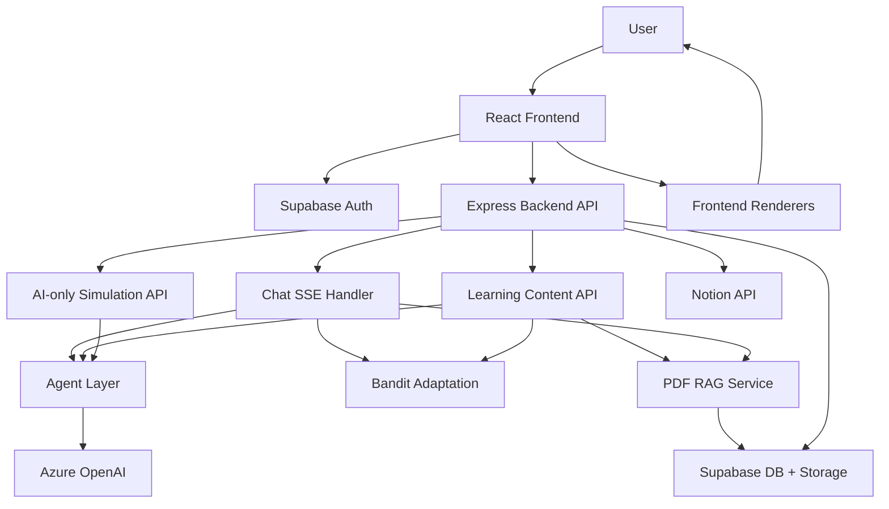
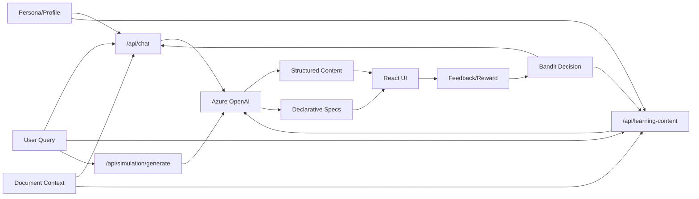
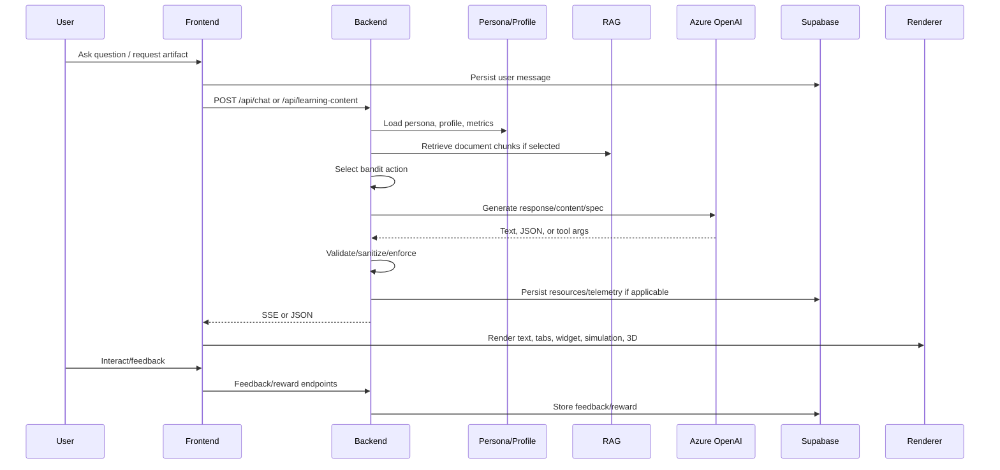

# PROJECT KNOWLEDGE PACKAGE

Generated: 2026-05-24

Source of truth: current working tree under `C:\Users\rashm\Downloads\visuvalearn-main\visuvalearn-main`.

Important note: this package documents the current implementation state, including uncommitted working-tree changes and deleted legacy files shown by `git status`. It does not describe an ideal architecture or older assumptions.

---

## SECTION 1: Project Overview

Project name: VisuaLearn

Purpose: VisuaLearn is an adaptive AI learning platform where users ask educational questions and receive dynamically generated learning experiences: conversational answers, structured learning tabs, quizzes, flashcards, mind maps, document-grounded answers, generated visualizations, and adaptive 2D/3D simulations.

Main user workflow:

1. User signs in through Supabase auth.
2. User starts a new chat or opens an existing conversation.
3. User asks a question, optionally selecting web search, an uploaded PDF document, a persona, or a requested learning artifact from the plus menu.
4. Frontend sends the message to the backend chat SSE endpoint.
5. Backend builds a persona-aware and optionally document-grounded system prompt, asks Azure OpenAI for a streaming response, and optionally permits declarative widget tool calls.
6. Frontend persists messages to Supabase and renders assistant text, widgets, and learning workspace content.
7. If the user enters Learning Mode or requests an artifact, frontend calls `/api/learning-content`.
8. Backend classifies intent, selects adaptive policy/bandit action, invokes the appropriate learning agent, optionally runs RAG or web search, detects simulation suitability, persists generated learning resources, and returns structured content.
9. Frontend renders Learn, Quiz, Flashcards, Mind Map, Simulation, and Notion export surfaces.
10. User behavior, quiz answers, simulation feedback, and feedback buttons feed adaptive state and future personalization.

Core features:

- Streaming chat through Server-Sent Events.
- Supabase authentication and conversation/message persistence.
- Persona system with system and custom personas.
- Adaptive learning content generation with intent routing.
- Contextual bandit adaptation using LinUCB-style policy, reward logging, enforcement, and fallback.
- Document upload and RAG over PDFs.
- Optional web search context for learning content.
- Structured Learn tab content, quizzes, flashcards, mind maps, examples, and regenerated explanation blocks.
- AI-only dynamic simulation engine producing declarative 2D simulation specs and optional declarative 3D scene specs.
- Deterministic frontend renderers for simulation specs and 3D scenes.
- Widget renderer for safe declarative visual specs.
- TTS endpoint and listen buttons.
- Feedback collection and simulation-specific feedback.
- Notion OAuth connection and one-way export of learning artifacts.
- Asset pipeline for image generation and fact checking from learning plans.
- Admin APIs for cache, circuit breaker, and agent stats.

Current architecture philosophy:

- AI generates structured JSON/specifications, not executable frontend code.
- Renderers are deterministic, local, and capability-bounded.
- Backend owns AI calls, validation, rate limiting, cost tracking, auth, RAG, and persistence.
- Frontend owns interaction state, tab state, rendering, optimistic conversation UX, and local learning intelligence.
- Simulations are dynamic and AI-only; hardcoded template registries and topic-to-generator mappings are removed.
- Normal chat remains conversational by default. Structured learning artifacts are opt-in through explicit user actions.
- Adaptive policy is authoritative for learning behavior, but the UI still gives users explicit control over tabs and artifacts.

---

## SECTION 2: Complete Project Structure

The following tree focuses on project source, migrations, public assets, and config. Generated dependency/build folders such as `node_modules/`, `frontend/dist/`, and archived report-template material are intentionally excluded from this source-of-truth tree.

```text
visuvalearn-main/
|-- PROJECT_KNOWLEDGE_PACKAGE.md
|-- Majorproject-report.zip
|-- outputs/
|   `-- paper-peer-review.md
|-- final report/
|-- Project-Report-Template-main/
|   |-- LaTeX report templates, cover pages, chapters, figures, and PDFs
|
|-- backend/
|   |-- package.json
|   |-- package-lock.json
|   |-- README.md
|   |-- server.js
|   |-- migrations/
|   |   |-- 003_learning_resources.sql
|   |   |-- 004_personas.sql
|   |   `-- 005_notion_export.sql
|   |-- routes/
|   |   `-- chat.js
|   `-- src/
|       |-- server.js
|       |-- api/
|       |   |-- index.js
|       |   |-- assets/
|       |   |   |-- controller.js
|       |   |   `-- routes.js
|       |   |-- chat/
|       |   |   `-- handler.js
|       |   |-- documents/
|       |   |   `-- routes.js
|       |   |-- feedback/
|       |   |   |-- controller.js
|       |   |   `-- routes.js
|       |   |-- learning/
|       |   |   `-- index.js
|       |   |-- notion/
|       |   |   `-- routes.js
|       |   |-- personas/
|       |   |   `-- routes.js
|       |   |-- plan/
|       |   |   |-- controller.js
|       |   |   |-- routes.js
|       |   |   `-- schemas.js
|       |   |-- resources/
|       |   |   `-- routes.js
|       |   |-- simulation/
|       |   |   `-- routes.js
|       |   |-- tts/
|       |   |   `-- routes.js
|       |   `-- user/
|       |       |-- controller.js
|       |       |-- routes.js
|       |       `-- schemas.js
|       |-- agents/
|       |   |-- base-agent.js
|       |   |-- registry.js
|       |   |-- index.js
|       |   |-- planner.js
|       |   |-- personalization.js
|       |   |-- personalization-bandit.js
|       |   |-- learning-orchestrator.js
|       |   |-- learning-content.js
|       |   |-- quick-explain.js
|       |   |-- conceptual.js
|       |   |-- coding-help.js
|       |   |-- visual-intelligence.js
|       |   |-- image-generator.js
|       |   `-- fact-checker.js
|       |-- bandit/
|       |   |-- index.js
|       |   |-- algorithm.js
|       |   |-- context.js
|       |   |-- enforcement.js
|       |   |-- evaluation.js
|       |   |-- logger.js
|       |   |-- reward.js
|       |   `-- store.js
|       |-- config/
|       |   |-- environment.js
|       |   `-- modelVersions.js
|       |-- database/
|       |   |-- client.js
|       |   `-- index.js
|       |-- feedback/
|       |   `-- analyzer.js
|       |-- middleware/
|       |   |-- authMiddleware.js
|       |   |-- errorHandler.js
|       |   |-- index.js
|       |   |-- rateLimitMiddleware.js
|       |   `-- traceMiddleware.js
|       |-- pipeline/
|       |   `-- asset-pipeline.js
|       |-- services/
|       |   |-- auth.js
|       |   |-- assetCache.js
|       |   |-- cache.js
|       |   |-- circuitBreaker.js
|       |   |-- costTracker.js
|       |   |-- index.js
|       |   |-- intentClassifier.js
|       |   |-- learningState.js
|       |   |-- logger.js
|       |   |-- rateLimiter.js
|       |   |-- webSearch.js
|       |   |-- memory/
|       |   |   |-- adapter.js
|       |   |   |-- index.js
|       |   |   `-- manager.js
|       |   |-- notion/
|       |   |   |-- document.js
|       |   |   `-- service.js
|       |   |-- openai/
|       |   |   |-- azure-client.js
|       |   |   `-- prompts.js
|       |   `-- rag/
|       |       |-- index.js
|       |       `-- pdfProcessor.js
|       |-- simulation/
|       |   `-- adaptive-engine.js
|       `-- utils/
|           |-- errors.js
|           |-- logger.js
|           `-- sanitize-widget.js
|
`-- frontend/
    |-- package.json
    |-- package-lock.json
    |-- vite.config.js
    |-- vercel.json
    |-- eslint.config.js
    |-- index.html
    |-- README.md
    |-- public/
    |   |-- favicon.svg
    |   |-- icons.svg
    |   `-- visualearn-favicon.svg
    `-- src/
        |-- App.jsx
        |-- main.jsx
        |-- index.css
        |-- assets/
        |   |-- hero.png
        |   |-- react.svg
        |   `-- vite.svg
        |-- components/
        |   |-- AdaptiveExplanation.jsx
        |   |-- AdaptiveFeedbackBanner.jsx
        |   |-- AssetProgress.jsx
        |   |-- ChatWindow.jsx
        |   |-- DocumentList.jsx
        |   |-- DocumentUpload.jsx
        |   |-- FactCheckBadge.jsx
        |   |-- FeedbackButtons.jsx
        |   |-- ImageWidget.jsx
        |   |-- InputBar.jsx
        |   |-- LearningFeedbackButtons.jsx
        |   |-- LearningPlanCard.jsx
        |   |-- LearningPlanInput.jsx
        |   |-- LearningStatePanel.jsx
        |   |-- LearningWorkspace.jsx
        |   |-- LogoMark.jsx
        |   |-- MessageBubble.jsx
        |   |-- MessageList.jsx
        |   |-- PersonaBadge.jsx
        |   |-- PersonaCard.jsx
        |   |-- PersonaEditor.jsx
        |   |-- PersonaSelectionModal.jsx
        |   |-- ProtectedRoute.jsx
        |   |-- SessionSummary.jsx
        |   |-- Sidebar.jsx
        |   |-- WelcomeScreen.jsx
        |   |-- WidgetFrame.jsx
        |   |-- WidgetLoading.jsx
        |   `-- learning/
        |       |-- CodingHelpView.jsx
        |       |-- ConceptsView.jsx
        |       |-- ConceptualView.jsx
        |       |-- EngagingLoader.jsx
        |       |-- FlashcardsView.jsx
        |       |-- InteractiveText.jsx
        |       |-- LearnTabView.jsx
        |       |-- LearningPathView.jsx
        |       |-- ListenButton.jsx
        |       |-- MindMapTabView.jsx
        |       |-- MindMapView.jsx
        |       |-- QuickExplainView.jsx
        |       |-- QuizView.jsx
        |       |-- SimulationView.jsx
        |       |-- SkeletonLoader.jsx
        |       `-- simulation/
        |           |-- Adaptive3DScene.jsx
        |           `-- AdaptiveSimulationFrame.jsx
        |-- contexts/
        |   |-- AuthContext.jsx
        |   |-- LearningIntelligenceContext.jsx
        |   `-- PersonaContext.jsx
        |-- hooks/
        |   |-- index.js
        |   |-- useAssetStream.js
        |   |-- useAuth.js
        |   |-- useBehaviorTracking.js
        |   |-- useChat.js
        |   |-- useDocuments.js
        |   |-- useFeedback.js
        |   |-- useLearningContent.js
        |   |-- useLearningPlan.js
        |   |-- useLearningResources.js
        |   |-- useLearningState.js
        |   |-- useProgress.js
        |   |-- useSimulation.js
        |   |-- useSpeechToText.js
        |   |-- useSSEStream.js
        |   |-- useTextToSpeech.js
        |   `-- useUnsplashImages.js
        |-- lib/
        |   `-- supabase.js
        |-- pages/
        |   |-- Dashboard.jsx
        |   |-- HomePage.jsx
        |   |-- LearningPage.jsx
        |   |-- LoginPage.jsx
        |   |-- NewChatPage.jsx
        |   |-- SettingsPage.jsx
        |   `-- SignupPage.jsx
        |-- services/
        |   |-- documentService.js
        |   |-- notionService.js
        |   `-- personaService.js
        `-- utils/
            |-- conversationActions.js
            |-- normalizeLearningContent.js
            |-- renderMarkdown.js
            |-- spacedRepetition.js
            `-- widgetSanitizer.js
```

Folder explanations:

- `backend/routes`: legacy top-level Express route location. Active chat SSE implementation still lives here as `routes/chat.js`; `src/api/chat/handler.js` re-exports it.
- `backend/src/api`: route registration and feature route modules. `api/index.js` is the central API mount.
- `backend/src/agents`: AI task abstractions and concrete agents for planning, personalization, learning content, quick explanations, conceptual answers, coding help, images, visual specs, and fact checking.
- `backend/src/bandit`: contextual bandit system: action selection, state encoding, rewards, enforcement, persistence, evaluation, and logging.
- `backend/src/config`: environment and model/deployment configuration.
- `backend/src/database`: Supabase service-role data access and high-level persistence helpers.
- `backend/src/feedback`: background feedback analysis.
- `backend/src/middleware`: Express auth, rate limits, tracing, error handling, and base middleware.
- `backend/src/pipeline`: asynchronous asset generation pipeline.
- `backend/src/services`: shared backend services, including Azure OpenAI adapter, RAG, memory, web search, learning state, Notion, cost tracking, cache, auth, and logging.
- `backend/src/simulation`: current dynamic AI-only simulation engine.
- `backend/src/utils`: backend utility helpers and sanitizers.
- `backend/migrations`: Supabase SQL migrations for learning resources, personas, Notion connections, and exports.
- `frontend/src/components`: reusable UI, chat, widget, learning, and simulation renderers.
- `frontend/src/contexts`: React contexts for auth, personas, and local learning intelligence.
- `frontend/src/hooks`: API/state hooks for chat, SSE, learning content, documents, simulations, feedback, resources, auth, behavior, and TTS.
- `frontend/src/lib`: frontend Supabase client and direct database helpers.
- `frontend/src/pages`: route-level pages.
- `frontend/src/services`: browser-side service wrappers for document, Notion, and persona APIs.
- `frontend/src/utils`: client-side normalization, rendering, spaced repetition, and conversation utilities.

---

## SECTION 3: Current Active Systems

### Chat System

Purpose: Stream conversational AI responses and optional declarative widget tool calls.

Input: `messages[]`, `userId`, `conversationId`, optional `personaId`, `temporaryStyle`, `documentId`, `preferences`, `learningAction`, and behavior metrics.

Output: SSE events: `text_delta`, `tool_use`, `message_complete`, `enforcement_result`, `done`, `error`, and `temporary_style_active` when applicable.

Dependencies: Express, auth middleware, rate limiter, Azure OpenAI chat client, persona database helpers, personalization profile, RAG service, bandit system, cache, learning state.

Files:

- `backend/routes/chat.js`
- `backend/src/api/index.js`
- `backend/src/api/chat/handler.js`
- `backend/src/services/openai/azure-client.js`
- `backend/src/services/openai/prompts.js`
- `frontend/src/hooks/useSSEStream.js`
- `frontend/src/hooks/useChat.js`
- `frontend/src/components/ChatWindow.jsx`
- `frontend/src/pages/NewChatPage.jsx`
- `frontend/src/pages/LearningPage.jsx`

Important behavior:

- Normal chat is text-only by default.
- Widget tool calls are only enabled when `learningAction` / `preferences.requestedArtifact` is present.
- Persona is fetched every request; the backend explicitly assumes models do not remember persona state.
- Document grounding is inserted into the system prompt when `documentId` is supplied.
- Bandit action is selected for context, but structured response enforcement only happens for explicit Learning Mode actions.

### Adaptive Learning Content System

Purpose: Generate structured learning content for Learn, Quiz, Flashcards, Mind Map, and regenerated explanation blocks.

Input: `query`, `userId`, optional `contentType`, `preferences`, `conversationId`, `messageId`, `documentId`, `webSearch`, `forceRefresh`.

Output: JSON response containing `content`, `responseMode`, `intentClassification`, `simulationDetection`, `banditDecision`, `enforcement`, `resourcesSaved`, and optional web search sources.

Dependencies: `LearningOrchestrator`, `LearningContentAgent`, `RegenerateBlockAgent`, personalization metrics, learning state, bandit, RAG, web search, simulation topic understanding, Supabase resource persistence.

Files:

- `backend/src/api/learning/index.js`
- `backend/src/agents/learning-orchestrator.js`
- `backend/src/agents/learning-content.js`
- `backend/src/services/intentClassifier.js`
- `frontend/src/hooks/useLearningContent.js`
- `frontend/src/pages/LearningPage.jsx`
- `frontend/src/components/learning/LearnTabView.jsx`
- `frontend/src/components/learning/QuizView.jsx`
- `frontend/src/components/learning/FlashcardsView.jsx`
- `frontend/src/components/learning/MindMapTabView.jsx`

Content types:

- `learn`: summary, key ideas, blocks, metadata.
- `quiz`: quiz questions only.
- `flashcards-mindmap`: flashcards and mind map together.
- no `contentType`: legacy combined all-content behavior.

### Intent Routing System

Purpose: Decide whether a query should be handled as quick explanation, deep learning, coding help, simulation-oriented learning, or conceptual non-CS explanation.

Input: raw learning query.

Output: `{ intent, complexity, domain, needsCode, suggestedDepth, confidence, reason, cached, fromHeuristic }`.

Dependencies: heuristic regex classifier, Azure OpenAI fallback, in-memory classification cache.

Files:

- `backend/src/services/intentClassifier.js`
- `backend/src/agents/learning-orchestrator.js`

Active modes:

- `quick_explain`
- `deep_learn`
- `coding_help`
- `simulation`
- `conceptual_noncs`

### Adaptive Simulation Engine

Purpose: Generate dynamic, AI-only 2D simulation specs and optional 3D scene specs from arbitrary educational queries.

Input: `query`, optional `userId`, `conversationId`, `previousSimulationId`, `feedbackContext`.

Output: `{ success, supported, simulationId, spec, topicUnderstanding, plan, telemetry, fallbackUsed, scene3d }`.

Dependencies: Azure OpenAI text completion, Supabase feedback/telemetry persistence, validation functions, deterministic frontend renderers.

Files:

- `backend/src/simulation/adaptive-engine.js`
- `backend/src/api/simulation/routes.js`
- `frontend/src/hooks/useSimulation.js`
- `frontend/src/components/learning/SimulationView.jsx`
- `frontend/src/components/learning/simulation/AdaptiveSimulationFrame.jsx`
- `frontend/src/components/learning/simulation/Adaptive3DScene.jsx`

Backend simulation agents/functions:

- `topicUnderstandingAgent`
- `simulationPlanningAgent`
- `simulationSpecGenerationAgent`
- `validationAgent`
- `threeDSuitabilityAgent`
- `scenePlanningAgent`
- `sceneSpecGenerationAgent`
- `validate3DSceneSpec`
- `recordSimulationFeedback`
- `generateAdaptiveSimulation`

### 2D Simulation Renderer

Purpose: Render backend declarative simulation specs in a sandboxed iframe.

Input: validated simulation spec with `steps`, `primitives`, `layout`, `animations`, and active step index.

Output: an `iframe` with `srcDoc` HTML containing deterministic SVG-based visualization.

Dependencies: React, local renderer helpers.

Files:

- `frontend/src/components/learning/simulation/AdaptiveSimulationFrame.jsx`
- `frontend/src/components/learning/SimulationView.jsx`

Renderer primitive types:

- `node`
- `edge`
- `bar`
- `text`
- `matrixCell`
- `timelineEvent`
- `flowBox`

### 3D Visualization System

Purpose: Render validated declarative 3D scene specs using React Three Fiber.

Input: `scene3d.spec.scene` with camera, background, controls, steps, objects, animations.

Output: React Three Fiber `<Canvas>` with OrbitControls, labels, meshes, edges, grid, and per-step active highlighting.

Dependencies: `three`, `@react-three/fiber`, `@react-three/drei`.

Files:

- `backend/src/simulation/adaptive-engine.js`
- `frontend/src/components/learning/simulation/Adaptive3DScene.jsx`
- `frontend/src/components/learning/SimulationView.jsx`

Supported object types:

- `sphere`
- `cube`
- `node`
- `edge`
- `arrow`
- `text`
- `particle`
- `matrix`
- `plane`
- `timeline`

### Widget Visualization System

Purpose: Render safe declarative visual specs produced by chat tool calls or visual-intelligence logic.

Input: widget object with `spec.version`, `spec.type`, `objects`, `animations`, `controls`, `explanation`.

Output: React-rendered visualization cards for flow, timeline, chart, network, matrix, sequence, comparison, graph, or fallback.

Dependencies: React, `WidgetFrame`, chat SSE tool parsing.

Files:

- `backend/routes/chat.js`
- `backend/src/services/openai/prompts.js`
- `frontend/src/hooks/useSSEStream.js`
- `frontend/src/components/WidgetFrame.jsx`
- `frontend/src/components/MessageList.jsx`

Important behavior:

- Backend rejects executable tool outputs using `EXECUTABLE_OUTPUT_PATTERN`.
- Backend sanitizes objects, controls, text, keys, and spec type.
- Frontend renders spec data with bounded renderers, not arbitrary code.
- `WidgetFrame` treats `3d_scene` as a supported type but renders it through the NetworkRenderer, not through the real 3D scene renderer.

### RAG / Document System

Purpose: Allow PDF upload, indexing, retrieval, document Q&A, summaries, previews, and document-grounded chat/learning responses.

Input: PDF upload, `documentId`, user query.

Output: document records, chunks, relevant context, RAG-backed answer or content.

Dependencies: Supabase Storage/table access, `pdf-parse`, Azure embeddings, Azure chat, multer.

Files:

- `backend/src/api/documents/routes.js`
- `backend/src/services/rag/index.js`
- `backend/src/services/rag/pdfProcessor.js`
- `backend/routes/chat.js`
- `backend/src/api/learning/index.js`
- `frontend/src/hooks/useDocuments.js`
- `frontend/src/services/documentService.js`
- `frontend/src/components/DocumentUpload.jsx`
- `frontend/src/components/DocumentList.jsx`

Tables:

- `documents`
- `document_chunks`

### Persona System

Purpose: Let the user choose or create AI response personas and inject persona behavior into every chat request.

Input: persona CRUD requests, selected persona id, temporary style override.

Output: default or selected persona object, merged prompt behavior.

Dependencies: Supabase `personas` and `user_profiles`, persona route API, chat prompt creation.

Files:

- `backend/src/api/personas/routes.js`
- `backend/src/database/client.js`
- `backend/src/services/openai/prompts.js`
- `frontend/src/contexts/PersonaContext.jsx`
- `frontend/src/services/personaService.js`
- `frontend/src/components/PersonaSelectionModal.jsx`
- `frontend/src/components/PersonaEditor.jsx`

System personas seeded by migration:

- Friendly Tutor
- Technical Expert
- Socratic Teacher
- Casual Buddy
- Strict Professor

### Contextual Bandit Adaptation System

Purpose: Choose adaptive learning actions, enforce content shape, collect reward, and improve future adaptation.

Input: user profile, topic, cognitive state, metrics, behavior, interaction signals, quiz answers.

Output: bandit decision envelope, selected action, enforcement status, reward updates, metrics.

Dependencies: Supabase or in-memory store fallback, `LinUCBBandit`, reward functions, enforcement monitors, evaluation modes.

Files:

- `backend/src/bandit/index.js`
- `backend/src/bandit/algorithm.js`
- `backend/src/bandit/context.js`
- `backend/src/bandit/enforcement.js`
- `backend/src/bandit/evaluation.js`
- `backend/src/bandit/logger.js`
- `backend/src/bandit/reward.js`
- `backend/src/bandit/store.js`
- `backend/src/agents/personalization-bandit.js`
- `backend/routes/chat.js`
- `backend/src/api/learning/index.js`

Tables:

- `bandit_decisions`
- `bandit_action_stats`
- `bandit_session_state`

### Learning State Engine

Purpose: Track cognitive state, topic progress, sessions, weak topics, strong topics, and progress summaries.

Input: user id, topic, attempts, session events, metrics.

Output: cognitive state, progress, weak/strong topics.

Dependencies: Supabase tables, backend services, frontend hooks.

Files:

- `backend/src/services/learningState.js`
- `frontend/src/hooks/useLearningState.js`
- `frontend/src/hooks/useProgress.js`
- `frontend/src/components/LearningStatePanel.jsx`
- `frontend/src/components/SessionSummary.jsx`

Tables:

- `topic_progress`
- `learning_sessions`
- `learning_state_snapshots`

### Local Learning Intelligence System

Purpose: Track client-side mastery, adaptive depth, quiz history, flashcard progress, weak/strong concepts, and recommendation hints.

Input: quiz results, concept interactions, flashcard review signals.

Output: local depth recommendation, concept status, weak/strong areas, recommendations.

Dependencies: browser `localStorage`.

Files:

- `frontend/src/contexts/LearningIntelligenceContext.jsx`
- `frontend/src/pages/LearningPage.jsx`
- `frontend/src/components/learning/QuizView.jsx`
- `frontend/src/components/learning/FlashcardsView.jsx`
- `frontend/src/utils/spacedRepetition.js`

Storage key:

- `visualearn_intelligence`

### Learning Resources Persistence System

Purpose: Persist generated tab artifacts per conversation so Learning Mode survives reloads and tab switching.

Input: `conversationId`, `messageId`, `resourceType`, `topic`, `content`.

Output: saved resources, available resource types, resource content for tabs.

Dependencies: Supabase `learning_resources`, backend resource routes, frontend hook.

Files:

- `backend/src/database/client.js`
- `backend/src/api/resources/routes.js`
- `backend/src/api/learning/index.js`
- `frontend/src/hooks/useLearningResources.js`
- `frontend/src/pages/LearningPage.jsx`

Resource types:

- `learn`
- `simulation`
- `visualization`
- `flashcards`
- `mindmap`
- `quiz`
- `examples`

### Feedback System

Purpose: Collect and query user feedback and simulation feedback; feed future adaptation.

Input: thumbs up/down, correction, suggestion, simulation helpful/not useful/regenerate.

Output: `feedback` rows, stats, user feedback lists, reward signals.

Dependencies: Supabase `feedback`, feedback controller, simulation engine, bandit reward recording.

Files:

- `backend/src/api/feedback/controller.js`
- `backend/src/api/feedback/routes.js`
- `backend/src/feedback/analyzer.js`
- `backend/src/simulation/adaptive-engine.js`
- `frontend/src/hooks/useFeedback.js`
- `frontend/src/components/FeedbackButtons.jsx`
- `frontend/src/components/LearningFeedbackButtons.jsx`
- `frontend/src/components/learning/SimulationView.jsx`

### Notion Export System

Purpose: Connect a user's Notion workspace and export selected learning artifacts as a structured Notion page.

Input: OAuth callback data, selected artifact types, conversation id, optional mind map PNG data URL.

Output: Notion page URL and export history.

Dependencies: Notion SDK/API, encrypted token storage, Supabase `notion_connections` and `notion_exports`.

Files:

- `backend/src/api/notion/routes.js`
- `backend/src/services/notion/service.js`
- `backend/src/services/notion/document.js`
- `frontend/src/services/notionService.js`
- `frontend/src/pages/LearningPage.jsx`
- `frontend/src/pages/SettingsPage.jsx`

### Asset Pipeline

Purpose: Generate images and fact-checking results from a learning plan through SSE.

Input: learning `plan`, optional `learningStyle`.

Output: SSE events for image assets, fact-check results, complete/done/errors.

Dependencies: `ImageGeneratorAgent`, `FactCheckerAgent`, memory manager.

Files:

- `backend/src/api/assets/controller.js`
- `backend/src/api/assets/routes.js`
- `backend/src/pipeline/asset-pipeline.js`
- `backend/src/agents/image-generator.js`
- `backend/src/agents/fact-checker.js`
- `frontend/src/hooks/useAssetStream.js`
- `frontend/src/components/AssetProgress.jsx`

Important current state:

- The API schema still describes widget asset events, but `AssetPipeline` currently creates images and fact-check results only. It no longer invokes `VisualIntelligenceAgent` in the active pipeline.

### TTS System

Purpose: Convert assistant text into audio.

Input: text.

Output: base64 audio payload.

Dependencies: Azure OpenAI TTS deployment and API version env vars.

Files:

- `backend/src/api/tts/routes.js`
- `frontend/src/hooks/useTextToSpeech.js`
- `frontend/src/components/MessageBubble.jsx`
- `frontend/src/components/learning/InteractiveText.jsx`
- `frontend/src/components/learning/ListenButton.jsx`

### Auth / Rate Limit / Cost / Logging System

Purpose: Protect routes, enforce ownership, rate-limit expensive actions, track daily usage, and log/trace errors.

Input: Bearer token, user id params, route type, model usage.

Output: authenticated request context, limit decisions, cost records, logs, optional Sentry events.

Dependencies: Supabase auth, rate-limiter libraries, in-memory or configured stores, Pino, Sentry.

Files:

- `backend/src/middleware/authMiddleware.js`
- `backend/src/middleware/rateLimitMiddleware.js`
- `backend/src/services/auth.js`
- `backend/src/services/rateLimiter.js`
- `backend/src/services/costTracker.js`
- `backend/src/services/logger.js`
- `backend/src/middleware/traceMiddleware.js`

---

## SECTION 4: Removed/Deprecated Systems

This section is based on the current code comments and working-tree deletions shown by Git.

### Old System: Template Simulation Generator Registry

Reason removed: runtime simulation output now comes from `backend/src/simulation/adaptive-engine.js`; predefined topic routing and static generator registries are intentionally disabled.

Replacement: AI-only adaptive simulation pipeline via `/api/simulation/generate`.

Removed/deleted files include:

- `backend/src/simulation/index.js`
- `backend/src/simulation/registry.js`
- `backend/src/simulation/schema.js`
- `backend/src/simulation/classifier.js`
- `backend/src/simulation/input-pipeline.js`
- `backend/src/simulation/key-mapper.js`
- `backend/src/simulation/cache.js`
- `backend/src/simulation/fallback.js`
- `backend/src/simulation/generators/**`

### Old System: Algorithm-Specific Backend Simulation Generators

Reason removed: hardcoded generator coverage does not match the new general AI-generated simulation goal.

Replacement: topic understanding, planning, spec generation, validation, fallback spec, and optional 3D scene generation in `adaptive-engine.js`.

Removed/deleted generator domains:

- array: binary search, linear search, bubble sort, heap sort, insertion sort, merge sort, quick sort, selection sort.
- graph: BFS, DFS, Dijkstra, Bellman-Ford, Floyd-Warshall, Kruskal, Prim.
- grid: A*, flood fill.
- dynamic programming: edit distance, Fibonacci, knapsack, LCS, LIS.
- tree: BST insert/search, traversals.
- heap: min heap, max heap.
- stack, linked list, timeline schedulers, state machines, Turing machine, math solvers.

### Old System: Frontend Template Simulation Components

Reason removed: the frontend no longer renders simulation classes by algorithm family.

Replacement: `AdaptiveSimulationFrame.jsx` for generic 2D declarative specs and `Adaptive3DScene.jsx` for generic 3D declarative scene specs.

Removed/deleted files include:

- `frontend/src/components/learning/simulation/ArraySimulation.jsx`
- `frontend/src/components/learning/simulation/GraphSimulation.jsx`
- `frontend/src/components/learning/simulation/GridSimulation.jsx`
- `frontend/src/components/learning/simulation/DPSimulation.jsx`
- `frontend/src/components/learning/simulation/HeapSimulation.jsx`
- `frontend/src/components/learning/simulation/LinkedListSimulation.jsx`
- `frontend/src/components/learning/simulation/MathSimulation.jsx`
- `frontend/src/components/learning/simulation/StackSimulation.jsx`
- `frontend/src/components/learning/simulation/StateMachineSimulation.jsx`
- `frontend/src/components/learning/simulation/TimelineSimulation.jsx`
- `frontend/src/components/learning/simulation/TreeSimulation.jsx`
- `frontend/src/components/learning/simulation/TuringMachineSimulation.jsx`
- `frontend/src/components/learning/simulation/GenericSimulation.jsx`

### Old System: Realtime Voice / PCM Processor

Reason removed: realtime browser audio support is not active in the current implementation.

Replacement: request/response TTS endpoint and frontend listen buttons.

Removed/deleted file:

- `frontend/public/pcm-processor.js`

### Old System: Executable Widget / MCP Tool Runtime

Reason removed: executable widgets are no longer accepted. The backend blocks script, HTML, SVG, DOM, imports, URLs, fetch, iframe, and other executable patterns in AI tool outputs.

Replacement: declarative visual specs validated by backend and rendered by `WidgetFrame`.

Removed/deleted file:

- `backend/src/services/widget-mcp-tools.js`

Active guardrails:

- `backend/routes/chat.js` uses `EXECUTABLE_OUTPUT_PATTERN`.
- `backend/src/utils/sanitize-widget.js` remains as a sanitizer utility.
- `frontend/src/utils/widgetSanitizer.js` remains for legacy/widget safety but the primary current path is declarative rendering.

### Old System: Adaptive Widget Generator Agents

Reason removed: old widget-generation agents were removed in favor of declarative specs and the new dynamic simulation engine.

Replacement: `VisualIntelligenceAgent` for declarative visual specs in plan contexts, chat tool spec sanitizer, and adaptive simulation engine for simulations.

Removed/deleted files:

- `backend/src/agents/adaptive-learning-engine.js`
- `backend/src/agents/adaptive-widget-generator.js`

### Old System: Visualization API Module

Reason removed: standalone visualization API is deleted in the current working tree.

Replacement: chat tool declarative widgets, learning content visual tabs, and simulation APIs.

Removed/deleted file:

- `backend/src/api/visualization/index.js`

### Old System: 3D Widget Detector / Skeleton

Reason removed: 3D is now routed through the simulation engine's 3D suitability and scene spec agents, not a separate widget detector.

Replacement: `threeDSuitabilityAgent`, `scenePlanningAgent`, `sceneSpecGenerationAgent`, and `Adaptive3DScene`.

Removed/deleted files:

- `frontend/src/hooks/use3DWidget.js`
- `frontend/src/utils/detect3D.js`
- `frontend/src/components/Widget3DSkeleton.jsx`

### Deprecated Compatibility APIs Still Present

Old System: `POST /api/simulation`

Reason kept: compatibility wrapper for old callers.

Replacement: `POST /api/simulation/generate`.

Current behavior: still calls the AI-only pipeline and never imports predefined generators.

Old System: `GET /api/simulation/types`

Reason kept: compatibility discovery endpoint.

Replacement: no catalog; simulations are generated dynamically.

Current behavior: returns an empty `types` array and explanatory message.

Old System: `GET /api/simulation/generators`

Reason kept: compatibility discovery endpoint.

Replacement: no predefined generators.

Current behavior: returns count 0 and explanatory message.

Old System: `GET /api/simulation/generators/:key`

Reason kept: compatibility endpoint.

Replacement: `POST /api/simulation/generate`.

Current behavior: returns 404 with message that predefined simulation generators are disabled.

Old System: `GET /api/simulation/cache-stats`

Reason kept: compatibility endpoint.

Replacement: dynamic telemetry persistence.

Current behavior: says template simulation cache is disabled.

---

## SECTION 5: Request Flow Mapping

### Normal Chat Flow

```text
User
  |
  v
Frontend NewChatPage or ChatWindow
  |
  v
useChat.sendMessage()
  |
  |-- creates conversation if needed
  |-- saves user message in Supabase
  |-- collects behavior metrics
  v
useSSEStream.startStream()
  |
  v
POST /api/chat
  |
  v
requireAuth + rateLimitChat
  |
  v
backend/routes/chat.js
  |
  |-- buildDocumentGrounding if documentId exists
  |-- getCachedProfile
  |-- getUserMetrics
  |-- getCognitiveState
  |-- getCachedPersona
  |-- getBanditDecision
  |-- createSystemPrompt
  |-- decide tools: [] for normal chat
  v
Azure OpenAI streaming chat
  |
  v
SSE text_delta / message_complete / done
  |
  v
Frontend accumulates currentMessage
  |
  v
useChat onComplete saves assistant message to Supabase
  |
  v
MessageList / MessageBubble renders text
```

### Chat With Requested Artifact / Widget Flow

```text
User selects plus-menu artifact
  |
  v
Frontend passes preferences.requestedArtifact
  |
  v
POST /api/chat with learningAction
  |
  v
Chat backend includes SHOW_WIDGET_TOOL
  |
  v
Azure OpenAI may return show_widget tool call
  |
  v
Backend parses tool arguments and sanitizes declarative spec
  |
  v
SSE tool_use event
  |
  v
useSSEStream creates frontend widget object
  |
  v
WidgetFrame renders declarative spec
  |
  v
Frontend auto-posts /api/tool-result to continue explanation
  |
  v
Backend records optional bandit interaction and streams continuation
```

### Learning Mode Flow

```text
User opens LearningPage or requests an artifact
  |
  v
useLearningContent.generateContent or fetchTabContent
  |
  v
POST /api/learning-content
  |
  v
requireAuth + rateLimitLearningContent
  |
  v
backend/src/api/learning/index.js
  |
  |-- initialize bandit
  |-- build cache key
  |-- load profile, metrics, cognitive state
  |-- getBanditDecision
  |-- retrieve RAG chunks if documentId
  |-- perform web search if enabled and no documentId
  |-- choose LearningOrchestrator for learn/all
  |-- choose LearningContentAgent for quiz/flashcards
  |-- pass bandit action + instructions
  |-- run content agent
  |-- run simulation topic detection for learn/all
  |-- enforce selected action
  |-- persist learning resources if conversationId
  v
JSON response
  |
  v
useLearningContent stores per-tab and legacy content
  |
  v
LearningPage renders active tab
```

### Simulation Flow

```text
Learning content generation
  |
  v
topicUnderstandingAgent detects simulation availability
  |
  v
Frontend receives simulationDetection
  |
  v
User opens Simulation tab or SimulationView auto-fetches
  |
  v
useSimulation.fetchSimulation()
  |
  v
POST /api/simulation/generate
  |
  v
generateAdaptiveSimulation()
  |
  |-- load feedback context
  |-- topicUnderstandingAgent
  |-- simulationPlanningAgent
  |-- simulationSpecGenerationAgent attempts
  |-- validationAgent
  |-- fallback spec if invalid/unsupported
  |-- threeDSuitabilityAgent
  |-- scenePlanningAgent if 3D suitable
  |-- sceneSpecGenerationAgent attempts
  |-- validate3DSceneSpec
  |-- fallback 3D scene if needed
  |-- persist telemetry
  v
Response with 2D spec and optional scene3d
  |
  v
SimulationView chooses Adaptive3DScene when valid 3D exists, else AdaptiveSimulationFrame
```

### Visualization Flow

```text
AI output
  |
  |-- chat tool output -> sanitizeWidgetInput -> WidgetFrame
  |-- learning mind_map -> MindMapTabView / MindMapView
  |-- simulation 2D spec -> AdaptiveSimulationFrame
  |-- simulation 3D scene spec -> Adaptive3DScene
  |-- plan resources -> AssetPipeline image generation
```

### Feedback Flow

```text
User clicks feedback
  |
  v
Frontend hook/component
  |
  |-- /api/feedback for general feedback
  |-- /api/simulation/feedback for simulation feedback
  |-- /api/learning-content/quiz-answer for quiz correctness
  |-- /api/learning-content/track-interaction for learning interactions
  v
Backend persists feedback/reward
  |
  v
Bandit reward and future profile/feedback context can adjust subsequent behavior
```

### Document Flow

```text
User uploads PDF
  |
  v
DocumentUpload / useDocuments / documentService
  |
  v
POST /api/documents/upload
  |
  v
multer memory storage + Supabase document creation/storage
  |
  v
pdfProcessor extracts text and page chunks
  |
  v
RAG service generates embeddings and stores document_chunks
  |
  v
Chat or Learning request includes documentId
  |
  v
Backend verifies ownership and readiness
  |
  v
retrieveChunks + formatChunksAsContext
  |
  v
Prompt is grounded in retrieved excerpts
```

### Notion Export Flow

```text
User connects Notion in Settings or LearningPage
  |
  v
GET /api/notion/connect
  |
  v
Notion OAuth redirect/callback
  |
  v
Encrypted token stored in notion_connections
  |
  v
User selects artifacts in LearningPage
  |
  v
POST /api/notion/export
  |
  v
buildLearningDocument + documentToNotionBlocks
  |
  v
Notion page is created
  |
  v
notion_exports row is inserted and URL returned
```

---

## SECTION 6: Rendering Architecture

### Core Rule

AI should generate structured data, not executable rendering code. Renderers generate the actual UI.

### What AI Generates

Chat widget AI generates:

- `version`
- `title`
- `spec_type`
- `objects`
- `animations`
- `controls`
- `explanation`

Simulation AI generates:

- topic understanding JSON
- 2D simulation plan JSON
- 2D simulation spec JSON containing `steps`, `primitives`, `animations`, `interactionHints`
- 3D suitability JSON
- 3D scene plan JSON
- 3D scene spec JSON containing camera, objects, steps, animations, controls

Learning content AI generates:

- key ideas
- content blocks
- examples
- quizzes
- flashcards
- mind maps
- coding-help data
- quick-explain data
- conceptual non-CS data

Asset AI generates:

- image prompts and image results through Azure image API.
- fact-check claims and judgments.

### What Renderers Generate

Frontend renderers generate:

- DOM and React UI.
- SVG inside a sandboxed iframe for adaptive 2D simulations.
- Three.js meshes, labels, lines, lights, camera controls, and active highlighting for 3D scenes.
- React visualization cards for chat widget specs.
- React Flow-style/mind-map UI where applicable.
- Quiz, flashcard, interactive text, and learning tab layouts.

### Widget Renderer

Files:

- `frontend/src/components/WidgetFrame.jsx`
- `frontend/src/hooks/useSSEStream.js`
- `backend/routes/chat.js`

Backend responsibilities:

- Accept only declarative spec data through tool arguments.
- Reject executable output patterns.
- Normalize spec shape.
- Enforce allowed spec types and controls.
- Generate fallback visual spec on rejection.

Frontend responsibilities:

- Convert `tool_use` event into widget object.
- Render safe spec through `WidgetFrame`.
- Provide step/restart/speed interaction state.
- Report widget interaction callbacks.

Supported types:

- `timeline`
- `chart`
- `network`
- `flow`
- `matrix`
- `sequence`
- `comparison`
- `graph`
- `3d_scene` as network-style fallback in `WidgetFrame`

### Simulation Renderer

Files:

- `frontend/src/components/learning/simulation/AdaptiveSimulationFrame.jsx`
- `frontend/src/components/learning/SimulationView.jsx`

Backend responsibilities:

- Generate declarative 2D spec.
- Validate spec capabilities, primitive count, step count, animation depth, duplicate ids, invalid edges, dangerous strings.
- Normalize primitive fields, coordinates, colors, controls, steps, and animations.
- Return fallback spec if validation fails.

Frontend responsibilities:

- Manage current step, play/pause, speed, fullscreen.
- Render deterministic SVG from spec primitives.
- Use `sandbox=""` on iframe so srcDoc has no script privileges.
- Escape labels and text before interpolation.
- Render side panel for current step and explanation.

### 3D Renderer

Files:

- `backend/src/simulation/adaptive-engine.js`
- `frontend/src/components/learning/simulation/Adaptive3DScene.jsx`
- `frontend/src/components/learning/SimulationView.jsx`

Backend responsibilities:

- Decide if 3D is suitable.
- Generate declarative scene plan and scene spec.
- Validate object count, animation count, animation depth, object ids, edge/arrow references, colors, vectors, controls, and dangerous strings.
- Return fallback 3D scene if needed.

Frontend responsibilities:

- Render objects with React Three Fiber.
- Use `OrbitControls`.
- Pulse active objects by current step.
- Render labels with Drei `Text`.
- Render edges with Drei `Line`.
- Render grid helper and lights.

### Adaptive Renderer

Adaptive rendering is not a single component. It is the interaction between:

- backend bandit decision,
- intent classifier,
- learning orchestrator,
- content-specific React views,
- local Learning Intelligence depth state,
- persisted resources,
- simulation detection,
- user tab selection.

Files:

- `backend/src/api/learning/index.js`
- `backend/src/agents/learning-orchestrator.js`
- `backend/src/bandit/*`
- `frontend/src/pages/LearningPage.jsx`
- `frontend/src/contexts/LearningIntelligenceContext.jsx`
- `frontend/src/hooks/useLearningContent.js`

### Sandbox Usage

Active sandbox usage:

- `AdaptiveSimulationFrame` uses an iframe with `sandbox=""`, rendering generated HTML/SVG from deterministic frontend code.

Security posture:

- Simulation specs are JSON-only and validated server-side.
- Chat widget specs are sanitized server-side and rendered through bounded React renderers.
- Legacy sanitizer utilities still exist, but executable widget generation is no longer an intended active path.

---

## SECTION 7: Agent Architecture

### Agent: BaseAgent

Purpose: Common lifecycle, retry handling, timing, metrics, validation, and error shape for class-based agents.

Input: arbitrary agent input plus context.

Output: `{ success, result, executionTime, agent, retries }` or `{ success: false, error, errorCode, executionTime, agent, retries }`.

Failure cases: invalid input, retry exhaustion, non-retryable API errors, subclass `execute()` not implemented.

Dependencies: backend logger.

File: `backend/src/agents/base-agent.js`

### Agent: PlannerAgent

Purpose: Generate structured learning plans.

Input: goal/topic and profile/context.

Output: plan with title, steps, resources, examples, exercises.

Failure cases: model JSON failure, invalid plan shape, fallback plan path.

Dependencies: BaseAgent, Azure OpenAI.

File: `backend/src/agents/planner.js`

### Agent: PersonalizationAgent

Purpose: Analyze profile/interactions, detect learning style, update profile-derived strategy, compute metrics, and explain personalization.

Input: user id, messages, interactions, behavior, feedback, topic.

Output: profile analysis, learning style, recommendations, topic strengths, metrics, adaptive policy decisions.

Failure cases: missing profile, DB errors, incomplete metrics.

Dependencies: Supabase, BaseAgent, profile tables, feedback, topic history.

File: `backend/src/agents/personalization.js`

### Agent/System: Personalization Bandit

Purpose: Create contextual adaptive decisions and track decision lifecycle for personalization.

Input: user profile/context, topic, metrics, history.

Output: bandit decision envelope/action prompt.

Failure cases: insufficient data, store failure, fallback decision.

Dependencies: bandit modules and Supabase bandit tables.

File: `backend/src/agents/personalization-bandit.js`

### Agent: LearningOrchestrator

Purpose: Route learning queries to the right content agent by intent.

Input: query, profile, contentType, forceMode, skipIntentDetection.

Output: result from routed agent plus `_orchestration` metadata.

Failure cases: classifier failure defaults to `quick_explain`; routed agent failure returned by BaseAgent when run through `.run()`.

Dependencies: `classifyLearningIntent`, QuickExplainAgent, ConceptualAgent, CodingHelpAgent, LearnAgent.

File: `backend/src/agents/learning-orchestrator.js`

### Agent: QuickExplainAgent

Purpose: Generate concise explanations for simple factual or brief questions.

Input: query, profile, intent.

Output: quick explanation JSON with `responseMode: quick_explain`.

Failure cases: JSON parse/model failure, malformed result.

Dependencies: BaseAgent, Azure OpenAI.

File: `backend/src/agents/quick-explain.js`

### Agent: ConceptualAgent

Purpose: Generate rich non-CS conceptual explanations using visual descriptions, analogies, and process steps.

Input: query, profile, intent.

Output: conceptual learning JSON with `responseMode: conceptual_noncs`.

Failure cases: JSON parse/model failure, domain mismatch, malformed result.

Dependencies: BaseAgent, Azure OpenAI.

File: `backend/src/agents/conceptual.js`

### Agent: CodingHelpAgent

Purpose: Explain, debug, and fix coding problems.

Input: query, profile, intent, optional provided code.

Output: diagnosis, issues, fix strategy, corrected code, explanation with `responseMode: coding_help`.

Failure cases: missing code context for code-specific asks, JSON parse/model failure.

Dependencies: BaseAgent, Azure OpenAI.

File: `backend/src/agents/coding-help.js`

### Agent: LearnAgent

Purpose: Generate key ideas, summaries, and deep learning content for Learn tab.

Input: query, profile, document/web context, intent, simulation hints.

Output: structured Learn content with `responseMode: deep_learn`.

Failure cases: RAG missing context, JSON parse/model failure, fallback content.

Dependencies: BaseAgent, Azure OpenAI, RAG context, web search context.

File: `backend/src/agents/learning-content.js`

### Agent: ExamplesAgent

Purpose: Generate real-world examples for examples-oriented content.

Input: query, profile, document context.

Output: examples array.

Failure cases: no document content for document-specific examples, model failure.

Dependencies: BaseAgent, Azure OpenAI.

File: `backend/src/agents/learning-content.js`

### Agent: QuizAgent

Purpose: Generate quiz questions.

Input: query, profile, document context.

Output: quiz array.

Failure cases: no document content, malformed questions, model failure.

Dependencies: BaseAgent, Azure OpenAI.

File: `backend/src/agents/learning-content.js`

### Agent: FlashcardsMindMapAgent

Purpose: Generate flashcards and mind map together.

Input: query, profile, document context.

Output: flashcards array and mind map object.

Failure cases: no source context, malformed mind map, model failure.

Dependencies: BaseAgent, Azure OpenAI.

File: `backend/src/agents/learning-content.js`

### Agent: QuizFlashcardsAgent

Purpose: Legacy combined quiz and flashcards generation.

Input: query/profile.

Output: quiz plus flashcards.

Failure cases: same as child agents.

Dependencies: QuizAgent, FlashcardsMindMapAgent.

File: `backend/src/agents/learning-content.js`

Status: legacy helper, still present.

### Agent: MindMapAgent

Purpose: Legacy mind map wrapper around FlashcardsMindMapAgent.

Input: query/profile.

Output: `{ mind_map }`.

Failure cases: missing generated mind map.

Dependencies: FlashcardsMindMapAgent.

File: `backend/src/agents/learning-content.js`

Status: legacy helper, still present.

### Agent: LearningContentAgent

Purpose: Orchestrate learning content agents by `contentType`.

Input: query, profile, contentType.

Output: requested content type or combined content.

Failure cases: unknown content type, child agent failure.

Dependencies: LearnAgent, QuizAgent, FlashcardsMindMapAgent.

File: `backend/src/agents/learning-content.js`

### Agent: RegenerateBlockAgent

Purpose: Regenerate a single content block in a different explanation style.

Input: query, block, preferences.

Output: regenerated block.

Failure cases: missing block type, model failure.

Dependencies: BaseAgent, Azure OpenAI.

File: `backend/src/agents/learning-content.js`

### Agent: VisualIntelligenceAgent

Purpose: Generate declarative visual specs from learning plan resources.

Input: learning plan and learning style.

Output: widgets with bounded declarative specs.

Failure cases: plan missing steps, no visualization resources, invalid widgets.

Dependencies: BaseAgent.

File: `backend/src/agents/visual-intelligence.js`

Status: exported and active as an agent class, but current `AssetPipeline` does not call it.

### Agent: ImageGeneratorAgent

Purpose: Generate educational images using Azure image API and upload/store output.

Input: prompt and style.

Output: image URL, prompt, metadata.

Failure cases: missing Azure image config, image API errors, upload/storage errors.

Dependencies: Azure image endpoint, Supabase Storage, BaseAgent.

File: `backend/src/agents/image-generator.js`

### Agent: FactCheckerAgent

Purpose: RAG + LLM judge fact-checking pipeline.

Input: text to validate.

Output: extracted claims, verification statuses, confidence, sources, summary.

Failure cases: no claims, insufficient evidence, knowledge chunk retrieval failure, LLM judge failure.

Dependencies: Supabase `knowledge_chunks` and `fact_checks`, Azure OpenAI, BaseAgent.

File: `backend/src/agents/fact-checker.js`

### Simulation Agent Functions

Purpose: AI-only simulation pipeline.

Input: educational query, feedback context, topic understanding, plan.

Output: 2D simulation spec, optional 3D scene spec, telemetry, fallback status.

Failure cases: unsupported query, timeout, invalid JSON, dangerous content, unsupported renderer, too many primitives/objects, invalid references.

Dependencies: Azure OpenAI, Supabase feedback/telemetry.

File: `backend/src/simulation/adaptive-engine.js`

Functions:

- `topicUnderstandingAgent`
- `simulationPlanningAgent`
- `simulationSpecGenerationAgent`
- `validationAgent`
- `threeDSuitabilityAgent`
- `scenePlanningAgent`
- `sceneSpecGenerationAgent`
- `validate3DSceneSpec`

---

## SECTION 8: API Documentation

All routes are mounted under `/api` by `backend/src/api/index.js` unless noted.

| Method | Route | Purpose | Request | Response | Dependencies | Status |
|---|---|---|---|---|---|---|
| GET | `/api/health` | Health check | none | health JSON | middleware index | active |
| GET | `/api/usage/:id` | Daily usage stats | bearer token, user id | usage stats | costTracker, ownership auth | active |
| GET | `/api/progress/:id` | Learning progress | bearer token, user id | progress, weakTopics, strongTopics | learningState | active |
| POST | `/api/chat` | Streaming chat | messages, userId injected, persona/document/preferences | SSE | chat route, Azure OpenAI, RAG, bandit | active |
| POST | `/api/tool-result` | Continue after widget/tool rendering | messages, bandit metadata | SSE | chat route, Azure OpenAI, bandit reward | active |
| POST | `/api/user` | Create user profile | profile data | profile JSON | user controller, Supabase | active |
| GET | `/api/user/:id` | Get profile | id | profile JSON | user controller, Supabase | active |
| PUT | `/api/user/:id` | Update profile | update fields | updated profile | user controller, Supabase | active |
| POST | `/api/user/:id/detect-style` | Detect learning style | messages/behavior | style result | PersonalizationAgent | active |
| GET | `/api/user/:id/stats` | User stats | id | stats | user controller | active |
| GET | `/api/user/:id/metrics` | User metrics | id | metrics | personalization metrics | active |
| POST | `/api/user/:id/onboarding-quiz` | Process onboarding quiz | quiz answers | profile updates/result | user controller | active |
| GET | `/api/user/:id/onboarding-status` | Check onboarding status | id | status | user controller | active |
| POST | `/api/plan` | Generate learning plan | goal/preferences | plan | PlannerAgent | active |
| GET | `/api/plan/schema` | Plan schema | none | schema JSON | plan controller | active |
| POST | `/api/generate-assets` | Generate plan assets over SSE | plan, learningStyle | SSE image/fact-check/complete events | AssetPipeline | active but schema partly stale |
| GET | `/api/assets/schema` | Asset schema | none | schema JSON | assets controller | active |
| POST | `/api/feedback` | Submit feedback | messageId, type, content | saved feedback | feedback controller, Supabase | active |
| GET | `/api/feedback/stats` | Feedback statistics | query params | stats | feedback controller | active |
| GET | `/api/feedback/schema` | Feedback schema | none | schema JSON | feedback controller | active |
| GET | `/api/feedback/user/:userId` | User feedback | user id | feedback list | feedback controller | active |
| POST | `/api/learning-content` | Generate structured learning content | query, userId, contentType, preferences, documentId, webSearch | content JSON | learning API, agents, RAG, bandit | active |
| POST | `/api/learning-content/quiz-answer` | Process quiz answer | questionId, selectedAnswer, correctAnswer, decisionId | correctness JSON | bandit reward | active |
| POST | `/api/learning-content/track-interaction` | Track learning interaction | interactionType, data, decisionId | success JSON | bandit reward | active |
| POST | `/api/learning-content/regenerate-block` | Regenerate content block | query, block, preferences | regenerated block | RegenerateBlockAgent | active |
| POST | `/api/tts` | Convert text to speech | text | base64 audio | Azure TTS | active |
| POST | `/api/documents/upload` | Upload PDF | multipart file | document record/status | multer, RAG, Supabase | active |
| GET | `/api/documents` | List documents | bearer token | documents[] | RAG service | active |
| GET | `/api/documents/:id` | Get document status | document id | document JSON | RAG service | active |
| DELETE | `/api/documents/:id` | Delete document | document id | success | RAG service | active |
| POST | `/api/documents/:id/query` | Query document with RAG | query | answer/context | RAG, Azure OpenAI | active |
| GET | `/api/documents/:id/summary` | Document summary | document id | summary | RAG service | active |
| GET | `/api/documents/:id/preview` | Document preview/chunks | document id | preview data | RAG service | active |
| POST | `/api/simulation/detect` | Topic understanding only | query | supported/topic/domain/type/confidence | adaptive-engine | active |
| POST | `/api/simulation/generate` | Full adaptive simulation | query, conversationId, previousSimulationId, feedbackContext | spec, scene3d, telemetry | adaptive-engine | active |
| POST | `/api/simulation/feedback` | Simulation feedback | simulationId, sceneId, type, score, reason | success | adaptive-engine, feedback table | active |
| POST | `/api/simulation` | Compatibility simulation generation | query or topic | same as generate | adaptive-engine | deprecated compatibility |
| GET | `/api/simulation/types` | Compatibility discovery | none | empty types | simulation routes | deprecated compatibility |
| GET | `/api/simulation/generators` | Compatibility discovery | none | empty generators | simulation routes | deprecated compatibility |
| GET | `/api/simulation/generators/:key` | Old generator lookup | generator key | 404 disabled message | simulation routes | deprecated compatibility |
| GET | `/api/simulation/cache-stats` | Old cache stats | none | disabled message | simulation routes | deprecated compatibility |
| GET | `/api/notion/connect` | Start Notion OAuth | bearer token | auth URL/redirect | Notion service | active |
| GET | `/api/notion/callback` | OAuth callback | code, state | redirect/result | Notion service | active |
| GET | `/api/notion/status` | Connection status | bearer token | status | Notion service | active |
| DELETE | `/api/notion/disconnect` | Remove Notion connection | bearer token | success | Notion service | active |
| POST | `/api/notion/export` | Export artifacts | conversationId, artifactTypes, mindmapPngDataUrl | Notion URL | Notion service | active |
| GET | `/api/resources/:conversationId` | Get conversation resources | conversation id | resources[] | database client | active |
| GET | `/api/resources/:conversationId/types` | Get available resource types | conversation id | types[] | database client | active |
| GET | `/api/resources/:conversationId/:resourceType` | Get resource type | conversation id, type | resource | database client | active |
| POST | `/api/resources/:conversationId` | Save resource | type/topic/content | resource | database client | active |
| DELETE | `/api/resources/:conversationId/:resourceId` | Delete resource | ids | success | database client | active |
| GET | `/api/personas` | List personas | bearer token | personas[] | personas route, Supabase | active |
| GET | `/api/personas/default` | Get default persona | bearer token | persona | personas route | active |
| GET | `/api/personas/:id` | Get persona | persona id | persona | personas route | active |
| POST | `/api/personas` | Create persona | persona data | created persona | personas route | active |
| PUT | `/api/personas/:id` | Update persona | updates | updated persona | personas route | active |
| DELETE | `/api/personas/:id` | Delete persona | persona id | success | personas route | active |
| POST | `/api/personas/:id/set-default` | Set default persona | persona id | updated profile | personas route | active |
| POST | `/api/admin/invalidate-cache` | Invalidate asset cache | assetType or modelVersion | success/deleted count | assetCache, admin auth | active admin |
| GET | `/api/admin/cache-stats` | Cache stats | none | stats | assetCache, admin auth | active admin |
| GET | `/api/admin/circuit-breakers` | Circuit breaker status | none | status | agentRegistry, admin auth | active admin |
| POST | `/api/admin/circuit-breakers/reset` | Reset circuit breaker(s) | optional agentName | success | agentRegistry, admin auth | active admin |
| GET | `/api/admin/agents` | Agent stats | none | summary | agentRegistry, admin auth | active admin |

Frontend direct Supabase APIs:

- `frontend/src/lib/supabase.js` directly reads/writes `user_profiles`, `conversations`, `messages`, `feedback`, `flashcard_progress`, `study_streaks`.
- `frontend/src/pages/NewChatPage.jsx` and `frontend/src/pages/LearningPage.jsx` also directly write conversation/messages in places.

---

## SECTION 9: State Management

### Frontend State

Global/context state:

- `AuthContext`: `user`, `session`, `isLoading`, `error`, `isAuthenticated`.
- `PersonaContext`: available/default personas and setup state.
- `LearningIntelligenceContext`: local mastery, depth level, weak/strong areas, quiz history, flashcard progress, stats.

Hook state:

- `useChat`: messages, streaming state, current stream, widgets/assets, plan, learning content.
- `useSSEStream`: current assistant message, widget loading state, personalization meta, fact-check result, streaming buffers.
- `useLearningContent`: per-tab content, tab loading states, fetched tabs, combined legacy content, simulation detection, response mode, intent classification.
- `useLearningResources`: persisted resource list/types/content for a conversation.
- `useSimulation`: simulation spec, loading/error/source, simulation id, topic understanding, plan, telemetry, fallback status, 3D scene, feedback state.
- `useDocuments`: document list, upload state, selected document usage.
- `useLearningState` / `useProgress`: server learning profile/progress state.

Page/component state:

- `NewChatPage`: selected document, web search toggle, pending artifact, loading/error, suggestions.
- `ChatWindow`: show plan input/session summary/state panel/document upload, selected document, pending artifact, initial learning workspace tab.
- `LearningPage`: active tab, conversation/messages, stored content, read cards, visible/loaded/loading/error tabs, user query, document id, follow-up state, turn tabs, simulation detections, Notion export modal state.
- `SimulationView`: current step, playing, speed, fullscreen.

### Backend State

In-memory backend state:

- chat profile/persona cache through `cache.getOrSet`.
- learning content `contentCache` Map with 10 minute TTL.
- intent classification cache Map with 5 minute TTL.
- cost tracker in-memory daily usage unless backed externally.
- circuit breaker state in agent registry/circuit service.
- bandit runtime object and possible in-memory fallback state.

Persistent backend state:

- Supabase tables listed below.
- Supabase Storage for uploaded documents and generated images.
- Notion token encrypted storage.

### Persistent State / Tables

Observed tables used by current code:

- `user_profiles`
- `conversations`
- `messages`
- `feedback`
- `asset_cache`
- `fact_checks`
- `learning_resources`
- `personas`
- `documents`
- `document_chunks`
- `knowledge_chunks`
- `topic_progress`
- `learning_sessions`
- `learning_state_snapshots`
- `topic_history`
- `user_metrics`
- `flashcard_progress`
- `user_flashcards`
- `study_streaks`
- `bandit_decisions`
- `bandit_action_stats`
- `bandit_session_state`
- `simulation_telemetry`
- `notion_connections`
- `notion_exports`

### Conversation State

- Conversations and messages are stored in Supabase.
- `useChat` creates a conversation with a default title on first message.
- User and assistant messages are stored in `messages`.
- Assistant message metadata can include widgets, images, fact checks, document id, web search flag, and requested artifact.
- Conversation title can be auto-generated from first user text.
- LearningPage rebuilds the latest learning state from messages and persisted learning resources.

### Feedback State

- General feedback stored in `feedback`.
- Simulation feedback is normalized to `thumbs_up`, `thumbs_down`, or `suggestion` with metadata containing simulation id, scene id, original type, score, reason, and source.
- Quiz and interaction feedback can update bandit reward.
- Feedback analyzer exists but is separate from immediate response flow.

### Simulation State

Backend:

- Spec generation is stateless per request except for feedback context and telemetry persistence.
- Simulation telemetry is persisted to `simulation_telemetry` when available, with fallback to `asset_cache`.

Frontend:

- `useSimulation` stores the generated spec and scene.
- `SimulationView` stores current step/play/speed/fullscreen.
- Regenerate sends simulation feedback and then fetches a new simulation with previous id and feedback context.

### Learning State

Backend:

- `learningState.js` persists topic/cognitive/session state.
- Personalization and bandit use cognitive state and metrics as context.

Frontend:

- `LearningIntelligenceContext` stores local mastery in localStorage.
- `LearningPage` tracks read cards, loaded tabs, tab errors, and active content.
- `useLearningContent` tracks content by tab and caches fetched tabs for the current query.

---

## SECTION 10: Dependency Graph

### Normal Chat

```text
NewChatPage / ChatWindow
  |
  v
useChat
  |
  v
useSSEStream
  |
  v
POST /api/chat
  |
  v
backend/routes/chat.js
  |
  |-- createSystemPrompt / mergePersonaWithOverride
  |-- getCachedPersona / database/client.js
  |-- analyzeUserProfile / personalization.js
  |-- getUserMetrics / personalization.js
  |-- getCognitiveState / learningState.js
  |-- getBanditDecision / bandit/index.js
  |-- buildDocumentGrounding / rag/index.js
  |-- createTextCompletion stream / azure-client.js
  v
SSE response
```

### Learning Content

```text
LearningPage
  |
  v
useLearningContent
  |
  v
POST /api/learning-content
  |
  v
backend/src/api/learning/index.js
  |
  |-- analyzeUserProfile
  |-- getUserMetrics
  |-- getCognitiveState
  |-- getBanditDecision
  |-- retrieveChunks / formatChunksAsContext
  |-- searchForLearning
  |-- LearningOrchestrator
  |     |
  |     |-- classifyLearningIntent
  |     |-- QuickExplainAgent
  |     |-- ConceptualAgent
  |     |-- CodingHelpAgent
  |     `-- LearnAgent
  |-- LearningContentAgent
  |     |-- QuizAgent
  |     `-- FlashcardsMindMapAgent
  |-- topicUnderstandingAgent
  |-- enforceLearningContentAction
  `-- saveLearningResource
```

### Simulation

```text
LearningPage
  |
  v
SimulationView
  |
  v
useSimulation
  |
  v
POST /api/simulation/generate
  |
  v
generateAdaptiveSimulation
  |
  |-- loadFeedbackContext
  |-- topicUnderstandingAgent
  |-- simulationPlanningAgent
  |-- simulationSpecGenerationAgent
  |-- validationAgent
  |-- generateAdaptive3DScene
  |     |-- threeDSuitabilityAgent
  |     |-- scenePlanningAgent
  |     |-- sceneSpecGenerationAgent
  |     `-- validate3DSceneSpec
  `-- persistTelemetry
  |
  v
SimulationView
  |
  |-- AdaptiveSimulationFrame
  `-- Adaptive3DScene
```

### Document RAG

```text
DocumentUpload / useDocuments
  |
  v
/api/documents/upload
  |
  v
documents/routes.js
  |
  v
rag/pdfProcessor.js
  |
  v
rag/index.js
  |
  |-- createDocument
  |-- extractPdfText
  |-- splitTextIntoChunks
  |-- generateEmbedding
  |-- storeChunks
  v
Supabase documents + document_chunks
```

### Persona

```text
Persona UI
  |
  v
personaService
  |
  v
/api/personas/*
  |
  v
personas/routes.js
  |
  v
database/client.js persona helpers
  |
  v
Supabase personas + user_profiles.default_persona_id
  |
  v
Chat request includes personaId
  |
  v
createSystemPrompt
```

### Asset Pipeline

```text
ChatWindow / useAssetStream
  |
  v
POST /api/generate-assets
  |
  v
assets/controller.js
  |
  v
AssetPipeline
  |
  |-- ImageGeneratorAgent
  `-- FactCheckerAgent
  |
  v
SSE asset/image/fact_check events
```

---

## SECTION 11: Known Issues

### Duplicate Logic

- Chat exists in `backend/routes/chat.js` while `backend/src/api/chat/handler.js` re-exports it. This preserves legacy structure but splits API code outside `src/api`.
- Frontend has both `NewChatPage` and `ChatWindow` sending chat/document/artifact flows with overlapping state.
- Frontend uses both direct Supabase operations and backend APIs for similar domains.
- Learning content supports both per-tab lazy loading and legacy combined content, creating normalization and state duplication.
- Mind map and flashcards are generated together, but rendered as separate conceptual tabs.
- `LearningWorkspace.jsx` exists alongside the newer/full `LearningPage.jsx` tab system.

### Technical Debt

- `backend/package.json` has no `test` script even though `backend/README.md` documents `npm test`.
- `frontend/README.md` is still the default React/Vite template and does not describe VisuaLearn.
- `AssetPipeline` no longer generates widgets but `getAssetSchema()` still documents widget/code asset events.
- `VisualIntelligenceAgent` is exported but not wired into the current asset pipeline.
- `useSSEStream` handles `tool_use_start` and `tool_input_delta`, but the current backend chat stream only emits final `tool_use` after collecting tool calls.
- `WidgetFrame` lists `3d_scene` as supported, but renders it as a network visualization rather than using `Adaptive3DScene`.
- Several code comments contain "legacy behavior" or compatibility paths, especially in learning content and simulation routes.
- Some older sanitizer utilities remain even though executable widgets are no longer intended.

### Unsafe or Brittle Paths

- Multiple frontend files hardcode `http://localhost:3001` instead of consistently using `VITE_API_URL`.
- `MessageBubble` sends TTS without auth headers, but backend `/api/tts` is protected in `api/index.js`; this can fail depending on route/auth execution.
- `InteractiveText` and other TTS callers should be checked for auth header consistency.
- Backend uses service-role Supabase client. This is normal for server code but means route-level auth/ownership checks must be correct.
- Some routes rely on `req.user.userId`; some helpers check `req.user.id` too. Inconsistent shape can cause edge bugs.
- Document repair attempts happen in chat/learning when a ready document has zero chunks; that is useful but can add latency to user requests.

### Performance Issues

- Simulation generation may call multiple LLM agents and retry several times for 2D plus 3D.
- Learning content generation can call profile metrics, bandit, RAG/web search, content agents, simulation detection, enforcement, and persistence in one request.
- Chat RAG may repair/index unchunked documents inline.
- Frontend LearningPage is large and owns many concerns, which can increase re-render and maintenance cost.
- Local content caches are per-process; they do not survive backend restart and do not scale across instances without shared cache.

### Possible Conflicts

- Current Git working tree has many deleted template files and modified active files. Future assistants must not assume deleted generators still exist.
- Backend `README.md` describes several "Day 2/3/4" modules and routes that are partially stale.
- `backend/src/api/index.js` lists `POST /api/simulation` and `GET /api/simulation/types` as available while the preferred endpoint is `/api/simulation/generate`.
- Persona and profile data can be read by both frontend direct Supabase and backend routes; inconsistent updates could drift.
- Frontend local learning intelligence and backend learning state are separate systems and may disagree.

---

## SECTION 12: Future Planned Systems

The implementation points toward the following intended systems.

### AI-Only Simulation Engine

Current status: active.

Future direction:

- Continue replacing template generators with dynamic AI-generated specs.
- Improve validation coverage and renderer capabilities.
- Persist simulation outputs as learning resources after generation, not just detection placeholders.
- Add empirical render telemetry after frontend render completes.

### 3D Visualization Engine

Current status: active initial implementation.

Future direction:

- Expand object/animation semantics beyond simple meshes, labels, lines, and pulse highlighting.
- Add richer domain-specific declarative primitives while still avoiding executable AI code.
- Improve fallback routing when 3D is requested but topic is too abstract.
- Add renderer validation tests and screenshot checks.

### Contextual Bandit Learning Adaptation

Current status: active.

Future direction:

- Use more complete reward signals from quiz correctness, completion, retention, dwell time, feedback, and tab interactions.
- Improve cold-start policy.
- Reconcile frontend local learning intelligence with backend bandit context.
- Add experiment/evaluation dashboards from `bandit_decisions` and related stats.

### Empirical Testing

Current status: not clearly present as an automated test suite.

Future direction:

- Add unit tests for validators, intent classifier heuristics, simulation normalization, and bandit reward/enforcement.
- Add integration tests for `/api/chat`, `/api/learning-content`, `/api/simulation/generate`, RAG document flow, and Notion export.
- Add frontend tests for LearningPage tab state and simulation renderers.
- Add Playwright screenshot tests for 2D/3D rendering.

### Feedback-Driven Adaptation

Current status: partially active.

Future direction:

- Connect simulation feedback more directly to regeneration prompts and historical simulation quality.
- Feed feedback analyzer summaries into future content generation.
- Use explicit negative feedback to avoid repeating explanation styles or renderer choices.

### Unified Visualization Architecture

Current status: fragmented across WidgetFrame, MindMap views, AdaptiveSimulationFrame, Adaptive3DScene, and asset pipeline.

Future direction:

- Define one declarative visualization schema family with versioning.
- Make renderer capability negotiation explicit.
- Separate "learning artifact spec" from "simulation spec" while sharing common validation and telemetry.

---

## SECTION 13: Final Architecture Summary

### Architecture Diagram



### Data Flow Diagram



### System Interaction Diagram



### Risk Analysis

High-risk areas:

- AI-generated JSON quality. Mitigation: strict validators, retries, fallbacks, bounded schemas.
- Renderer/schema drift. Mitigation: versioned schemas and renderer capability checks.
- Auth shape inconsistency. Mitigation: standardize `req.user` shape and frontend auth headers.
- State duplication between frontend local intelligence and backend learning state. Mitigation: define source-of-truth ownership.
- Stale documentation/schema. Mitigation: update README and asset schema to reflect current AI-only/declarative implementation.
- Performance under multi-agent requests. Mitigation: cache, background jobs, streaming partial content, and request budgets.
- Hidden dependency on uncommitted deletes. Mitigation: commit or document removed systems before future implementation work.

### Extension Recommendations

1. Create a formal `visual-spec.schema.json` and `simulation-spec.schema.json`.
2. Add tests for `validationAgent`, `validate3DSceneSpec`, `sanitizeWidgetInput`, and `enforceLearningContentAction`.
3. Unify all frontend API base URLs behind `VITE_API_URL`.
4. Remove or mark stale docs/schema paths that mention executable widget code.
5. Persist generated simulation specs as `learning_resources` once the Simulation tab generates them.
6. Add frontend render telemetry endpoint for actual render time, errors, and step interactions.
7. Make `VisualIntelligenceAgent` either active in `AssetPipeline` or explicitly deprecated.
8. Split `LearningPage.jsx` into smaller stateful modules: tab state, turn history, Notion export, follow-up chat, and render pane.
9. Reconcile local `LearningIntelligenceContext` with backend `learningState.js` and bandit context.
10. Add architecture tests that fail if deleted template simulation imports are reintroduced.

### Final Summary

VisuaLearn's current real architecture is a React + Express + Supabase + Azure OpenAI learning platform built around dynamic AI generation and deterministic rendering. The most important recent architectural shift is the removal of template simulation registries and executable widget systems. The active direction is declarative: AI produces constrained specs and structured content; backend validators enforce safety and shape; frontend renderers produce actual UI, SVG, and Three.js scenes.

Future implementation prompts should assume:

- no predefined simulation generator registry,
- no executable AI widget code,
- dynamic simulation specs from `backend/src/simulation/adaptive-engine.js`,
- frontend simulation rendering through `AdaptiveSimulationFrame` and `Adaptive3DScene`,
- chat widget rendering through `WidgetFrame`,
- adaptive learning orchestration through `LearningOrchestrator`, `LearningContentAgent`, and bandit modules,
- persistence through Supabase conversations, messages, learning resources, feedback, documents, personas, and Notion tables.
